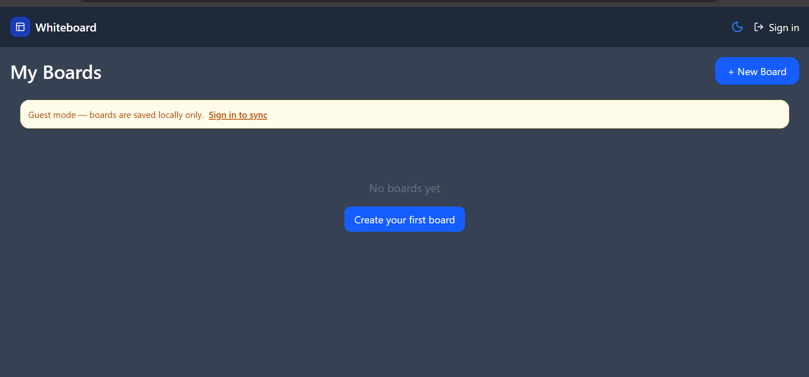

# WhiteboardCollaboration

Collaborative online whiteboard app built with a Next.js client and an Express, MongoDB, and Socket.io backend. Users can create boards, draw on a Fabric.js canvas, save canvas state, invite collaborators, and collaborate in real time.

## Tech Stack

### Client

- Next.js `16.2.4`
- React `19.2.4`
- Tailwind CSS v4
- Fabric.js `7.3.1`
- Socket.io client `4.8.3`
- Axios
- next-themes
- React Toastify
- NextAuth is installed and partially configured, but the active app flow uses the Express auth API and HTTP-only cookie.

### Server

- Express `4.18.2`
- Socket.io `4.7.5`
- MongoDB with Mongoose `8.3.0`
- JWT authentication
- bcryptjs password hashing
- cookie-parser
- cors
- helmet
- Brevo email API through Axios

## Project Structure

```txt
client/                     Next.js frontend
client/app/page.jsx          Board list page
client/app/auth/page.jsx     Login/signup page
client/app/board/[id]/       Whiteboard editor page
client/app/join/[token]/     Join route placeholder
client/app/context/          Client auth context
client/components/           Canvas, auth cards, navbar, editor UI
client/hooks/useSocket.js    Socket.io hook

server/                     Express backend
server/index.js             Server entry, middleware, routes, sockets
server/routes/auth.js       Auth routes
server/routes/boards.js     Board CRUD and invite routes
server/middleware/auth.js   JWT cookie auth middleware
server/models/user.js       User schema
server/models/board.js      Board schema
server/socket/canvas.js     Socket.io canvas events
server/utils/               Email and OTP utilities
```

## Environment Variables

### Server `.env`

Create `server/.env`:

```env
PORT=4000
MONGO_URI=mongodb://localhost:27017/whiteboard
JWT_SECRET=replace_with_a_long_secret
CLIENT_URL=http://localhost:3000
SMTP_MAIL=your_sender_email@example.com
BREVO_API_KEY=your_brevo_api_key
```

`CLIENT_URL` is used for both Express CORS and Socket.io CORS. The login cookie is configured as `secure: true` and `sameSite: "none"`, so HTTPS is required in production. For local HTTP development, browser cookie behavior may need adjustment.

### Client `.env.local`

Create `client/.env.local`:

```env
NEXT_PUBLIC_API_URL=http://localhost:4000
```

Optional values for the experimental NextAuth route:

```env
GOOGLE_CLIENT_ID=your_google_client_id
GOOGLE_CLIENT_SECRET=your_google_client_secret
NEXTAUTH_URL=http://localhost:3000
NEXTAUTH_SECRET=replace_with_a_long_secret
```

## Install and Run

### Backend

```bash
cd server
npm install
npm run dev
```

Production-style start:

```bash
cd server
npm start
```

### Frontend

```bash
cd client
npm install
npm run dev
```

Open:

- Client: `http://localhost:3000`
- Server health check: `http://localhost:4000`

## Client Routes

### `/`

Board dashboard.

- Guest users see boards from `localStorage`.
- Logged-in users fetch boards from `GET /api/boards`.
- Create board:
  - Guest: creates a local board in `localStorage`.
  - Logged in: calls `POST /api/boards`.
- Delete board:
  - Guest: removes local board data.
  - Logged in: calls `DELETE /api/boards/:id`.

### `/auth`

Login/signup page.

- Login uses `POST /api/auth/login`.
- Signup uses `POST /api/auth/register`.
- After signup, the user is redirected to `/auth/verifyotp/:email`.

### `/auth/verifyotp/:email`

OTP verification page.

- Calls `POST /api/auth/verify-otp`.
- On success, redirects to `/`.

Note: the current client code calls `/api/auth//verify-otp` with a double slash. Express usually handles this, but the intended endpoint is `/api/auth/verify-otp`.

### `/board/:id`

Whiteboard editor.

- Loads local canvas state first from `localStorage` key `canvas_${id}`.
- For logged-in boards, falls back to `GET /api/boards/:id`.
- Saves locally on canvas object add/modify/remove.
- Saves remote canvas state through `PUT /api/boards/:id`.
- Auto-saves logged-in boards to the database every 30 seconds.
- Supports PNG and PDF export.
- Uses Socket.io for cursor movement and realtime object additions.

Guest board IDs use the route format `/board/guest_guest_<timestamp>` because the current board object stores `guestId` as `guest_<timestamp>` and the route prepends `guest_`.

### `/join/:token`

Join route placeholder. The current page only renders `Join`; it does not yet call `GET /api/boards/join/:token`.

### `/api/auth/[...nextauth]`

NextAuth route exists in `client/app/api/auth/[...nextauth].js`.

- Google provider is configured.
- On sign-in, it tries to connect through `@/lib/dbConnect` and `@/models/User`.
- This flow is separate from the active Express cookie auth flow used by `AuthContext.tsx`.
- `client/app/api/auth/[...nextauth]/route.js` is commented out.

## Authentication Flow

1. User registers with name, email, and password.
2. Server validates fields, hashes the password through the User model pre-save hook, generates a 5-digit OTP, stores expiry for 5 minutes, and sends the OTP email through Brevo.
3. User verifies OTP.
4. User logs in.
5. Server sets an HTTP-only cookie named `token`.
6. Protected board routes read `req.cookies.token`, verify it with `JWT_SECRET`, load the user, and attach it as `req.user`.
7. Client stores the returned user object in `localStorage`.
8. On login, guest boards from `localStorage.guest_boards` are migrated into MongoDB.

## REST API

Base URL in local development:

```txt
http://localhost:4000
```

All protected routes require the `token` HTTP-only cookie. Axios should use `withCredentials: true`.

### Health Check

#### `GET /`

Response `200`:

```json
{
  "message": "Server running.."
}
```

## Auth API

### `POST /api/auth/register`

Creates an unverified user and sends an OTP email.

Request body:

```json
{
  "name": "Ada Lovelace",
  "email": "ada@example.com",
  "password": "password123"
}
```

Validation:

- `name` is required and must be at least 3 characters.
- `email` must be valid.
- `password` must be at least 8 characters.

Success response `201`:

```json
{
  "success": true,
  "message": "Verification email sent to ada@example.com. Please check your inbox."
}
```

Validation error response `400`:

```json
{
  "success": false,
  "errors": [
    {
      "type": "field",
      "msg": "Password must be at least 8 characters.",
      "path": "password",
      "location": "body"
    }
  ]
}
```

Existing user response `400`:

```json
{
  "message": "User already exists with this email."
}
```

Server error response `500`:

```json
{
  "error": "error message"
}
```

### `POST /api/auth/verify-otp`

Verifies a user's email OTP.

Request body:

```json
{
  "email": "ada@example.com",
  "otp": "12345"
}
```

Success response `200`:

```json
{
  "message": "Email verified successfully.",
  "user": {
    "id": "mongodb_user_id",
    "name": "Ada Lovelace",
    "email": "ada@example.com"
  }
}
```

Invalid user or OTP response `400`:

```json
{
  "message": "Invalid OTP."
}
```

Expired OTP response `400`:

```json
{
  "message": "OTP has expired. Please request a new one."
}
```

Too many attempts response `429`:

```json
{
  "message": "Too many attempts"
}
```

Validation error response `400`:

```json
{
  "success": false,
  "errors": []
}
```

### `POST /api/auth/login`

Logs in a verified user and sets the `token` cookie.

Request body:

```json
{
  "email": "ada@example.com",
  "password": "password123"
}
```

Success response `200`:

```json
{
  "message": "Login successfully.",
  "status": true,
  "user": {
    "id": "mongodb_user_id",
    "name": "Ada Lovelace"
  }
}
```

Cookie set on success:

```txt
token=<jwt>; HttpOnly; Secure; SameSite=None; Max-Age=7 days
```

Invalid credentials response `401`:

```json
{
  "error": "Invalid credentials"
}
```

Unverified account response `403`:

```json
{
  "message": "Account not verified. Please check your email for the OTP."
}
```

Validation error response `400`:

```json
{
  "success": false,
  "errors": []
}
```

### `POST /api/auth/logout`

Clears the `token` cookie.

Success response `200`:

```json
{
  "status": true
}
```

## Board API

### Auth Errors

Protected board routes can return:

No cookie:

```json
{
  "error": "No token"
}
```

Invalid JWT:

```json
{
  "error": "Invalid token"
}
```

Deleted/missing user:

```json
{
  "error": "User not found"
}
```

### `GET /api/boards`

Returns boards where the authenticated user is the owner or a collaborator.

Success response `200`:

```json
[
  {
    "_id": "mongodb_board_id",
    "title": "Planning Board",
    "owner": "mongodb_user_id",
    "collaborators": [],
    "canvasState": "{}",
    "isPublic": false,
    "createdAt": "2026-05-02T10:00:00.000Z",
    "updatedAt": "2026-05-02T10:00:00.000Z",
    "__v": 0
  }
]
```

Server error response `500`:

```json
{
  "error": "Server error"
}
```

### `POST /api/boards`

Creates a board for the authenticated user.

Request body:

```json
{
  "title": "Planning Board",
  "canvasState": "{}",
  "isPublic": false
}
```

Success response `200`:

```json
{
  "_id": "mongodb_board_id",
  "title": "Planning Board",
  "owner": "mongodb_user_id",
  "collaborators": [],
  "canvasState": "{}",
  "isPublic": false,
  "createdAt": "2026-05-02T10:00:00.000Z",
  "updatedAt": "2026-05-02T10:00:00.000Z",
  "__v": 0
}
```

### `GET /api/boards/:id`

Gets a single board by MongoDB ObjectId.

Success response `200`:

```json
{
  "_id": "mongodb_board_id",
  "title": "Planning Board",
  "owner": "mongodb_user_id",
  "collaborators": [],
  "canvasState": "{}",
  "isPublic": false,
  "createdAt": "2026-05-02T10:00:00.000Z",
  "updatedAt": "2026-05-02T10:00:00.000Z",
  "__v": 0
}
```

Invalid id response `400`:

```json
{
  "error": "not found"
}
```

### `PUT /api/boards/:id`

Updates board data.

Request body examples:

```json
{
  "title": "Updated Board Name"
}
```

```json
{
  "canvasState": "{\"version\":\"7.3.1\",\"objects\":[]}"
}
```

Success response `200`:

```json
{
  "_id": "mongodb_board_id",
  "title": "Updated Board Name",
  "owner": "mongodb_user_id",
  "collaborators": [],
  "canvasState": "{}",
  "isPublic": false,
  "createdAt": "2026-05-02T10:00:00.000Z",
  "updatedAt": "2026-05-02T10:05:00.000Z",
  "__v": 0
}
```

Invalid id response `400`:

```json
{
  "error": "not found"
}
```

### `DELETE /api/boards/:id`

Deletes a board.

Success response `200`:

```json
{
  "success": true
}
```

Invalid id response `400`:

```json
{
  "error": "Invalid Board ID"
}
```

### `POST /api/boards/:id/invite`

Generates a client invite link for a board.

Current request body:

```json
{}
```

Success response `201`:

```json
{
  "link": "http://localhost:3000/join/mongodb_board_id"
}
```

Invalid id response `400`:

```json
{
  "error": "not found"
}
```

Missing board response `404`:

```json
{
  "success": false,
  "message": "Token not found"
}
```

Implementation note: this route currently returns a link using the board `_id`; it does not set `inviteToken`.

### `GET /api/boards/join/:token`

Adds the authenticated user as a collaborator for a board with a matching `inviteToken`.

Success response `200`:

```json
{
  "boardId": "mongodb_board_id"
}
```

Invalid link response `404`:

```json
{
  "error": "Invalid link"
}
```

Implementation note: the invite creation route currently does not write `inviteToken`, and the client `/join/:token` page does not call this endpoint yet.

## Socket.io Events

Socket server is initialized in `server/index.js` and event handlers are in `server/socket/canvas.js`.

Client connects to:

```txt
NEXT_PUBLIC_API_URL or http://localhost:4000
```

### `join-board`

Client emits:

```js
socket.emit("join-board", {
  boardId: "mongodb_board_id",
  user: {
    id: "mongodb_user_id",
    name: "Ada Lovelace"
  }
});
```

Server action:

- Joins the socket room named by `boardId`.
- Stores `{ boardId, user }` on `socket.data`.
- Broadcasts `user-joined` to other users in the room.

Other clients receive:

```js
socket.on("user-joined", (user) => {});
```

### `canvas-update`

Client emits:

```js
socket.emit("canvas-update", {
  boardId: "mongodb_board_id",
  delta: {
    type: "add",
    obj: {}
  }
});
```

Server broadcasts to other clients in the room:

```js
socket.on("canvas-update", (delta) => {});
```

Client implementation note: `Canvas.jsx` currently expects the received value to contain `data.delta`, while the server emits only `delta`. Align these shapes before relying on realtime object sync.

### `cursor-move`

Client emits:

```js
socket.emit("cursor-move", {
  boardId: "mongodb_board_id",
  user: {
    id: "mongodb_user_id",
    name: "Ada Lovelace"
  },
  x: 100,
  y: 200
});
```

Other clients receive:

```js
socket.on("cursor-move", {
  user: {
    id: "mongodb_user_id",
    name: "Ada Lovelace"
  },
  x: 100,
  y: 200
});
```

### `chat-message`

Client emits:

```js
socket.emit("chat-message", {
  boardId: "mongodb_board_id",
  user: {
    id: "mongodb_user_id",
    name: "Ada Lovelace"
  },
  text: "Hello"
});
```

All clients in the room receive:

```js
socket.on("chat-message", {
  user: {
    id: "mongodb_user_id",
    name: "Ada Lovelace"
  },
  text: "Hello",
  time: "2026-05-02T10:00:00.000Z"
});
```

### `disconnect`

When a socket disconnects, the server broadcasts `user-left` to the room if `boardId` and `user` exist in `socket.data`.

```js
socket.on("user-left", (user) => {});
```

## Data Models

### User

Defined in `server/models/user.js`.

```js
{
  name: String,
  email: String,
  password: String,
  profilePicture: String,
  accountVerified: Boolean,
  verificationCode: String,
  otpAttempts: Number,
  verificationCodeExpire: Date,
  resetPasswordToken: String,
  resetPasswordExpire: Date,
  createdAt: Date,
  updatedAt: Date
}
```

Important behavior:

- `password` is excluded by default with `select: false`.
- Password is hashed with bcrypt before save when modified.
- `accountVerified` defaults to `false`.
- `otpAttempts` defaults to `0`.

### Board

Defined in `server/models/board.js`.

```js
{
  title: String,
  owner: ObjectId,
  collaborators: [ObjectId],
  canvasState: String,
  isPublic: Boolean,
  inviteToken: String,
  createdAt: Date,
  updatedAt: Date
}
```

Defaults:

- `title`: `"Untitled Board"`
- `canvasState`: `"{}"`
- `isPublic`: `false`

## Local Storage Keys

The client uses local storage for fast saves and guest mode.

```txt
user                  Logged-in user object from login response
guest_boards          Array of guest boards
canvas_${boardId}     Fabric canvas JSON for a board
```

Guest board object shape:

```json
{
  "guestId": "guest_1714644000000",
  "title": "Untitled Board",
  "canvasState": "{}",
  "createdAt": "2026-05-02T10:00:00.000Z"
}
```

## Email and OTP

OTP generation is in `server/utils/generateVerificationCode.js`.

- Code length: 5 digits
- Expiry: 5 minutes

Email sending is in `server/utils/sendEmail.js`.

- Provider: Brevo SMTP email API
- Endpoint: `https://api.brevo.com/v3/smtp/email`
- Sender email comes from `SMTP_MAIL`.
- API key comes from `BREVO_API_KEY`.

## Scripts

### Server

```bash
npm run dev     # nodemon index.js
npm start       # node index.js
```

### Client

```bash
npm run dev     # next dev
npm run build   # next build
npm start       # next start
npm run lint    # eslint
```

## Current Implementation Notes

- Active authentication uses the Express API and the `token` HTTP-only cookie. NextAuth files exist, but they are not the main auth path used by the current `AuthContext`.
- Invite flow is incomplete: `POST /api/boards/:id/invite` returns `/join/:boardId`, but `GET /api/boards/join/:token` searches `inviteToken`, and the join page does not call the API yet.
- Socket canvas update payloads should be aligned. The server emits the raw `delta`, while `Canvas.jsx` currently checks for `data.delta`.
- The board `GET /api/boards/:id`, `PUT /api/boards/:id`, and `DELETE /api/boards/:id` routes validate ObjectId format but do not currently enforce board ownership.
- Registration sends email before saving the user. If email sending fails silently, user creation may still continue depending on the failure path in `sendEmail`.
- Login catch block references `e.message` instead of `error.message`; that can cause the error handler itself to fail.

## Troubleshooting

- If login succeeds but protected routes return `No token`, check browser cookie settings, HTTPS/SameSite behavior, `CLIENT_URL`, and Axios `withCredentials`.
- If CORS fails, ensure `server/.env` has `CLIENT_URL=http://localhost:3000` and the client uses `NEXT_PUBLIC_API_URL=http://localhost:4000`.
- If OTP email does not arrive, verify `SMTP_MAIL`, `BREVO_API_KEY`, and Brevo sender configuration.
- If boards do not load after login, confirm MongoDB is running and `MONGO_URI` is correct.
- If realtime drawing does not sync, check Socket.io connection URL and align the `canvas-update` payload shape.



## License


No license file is currently included.
